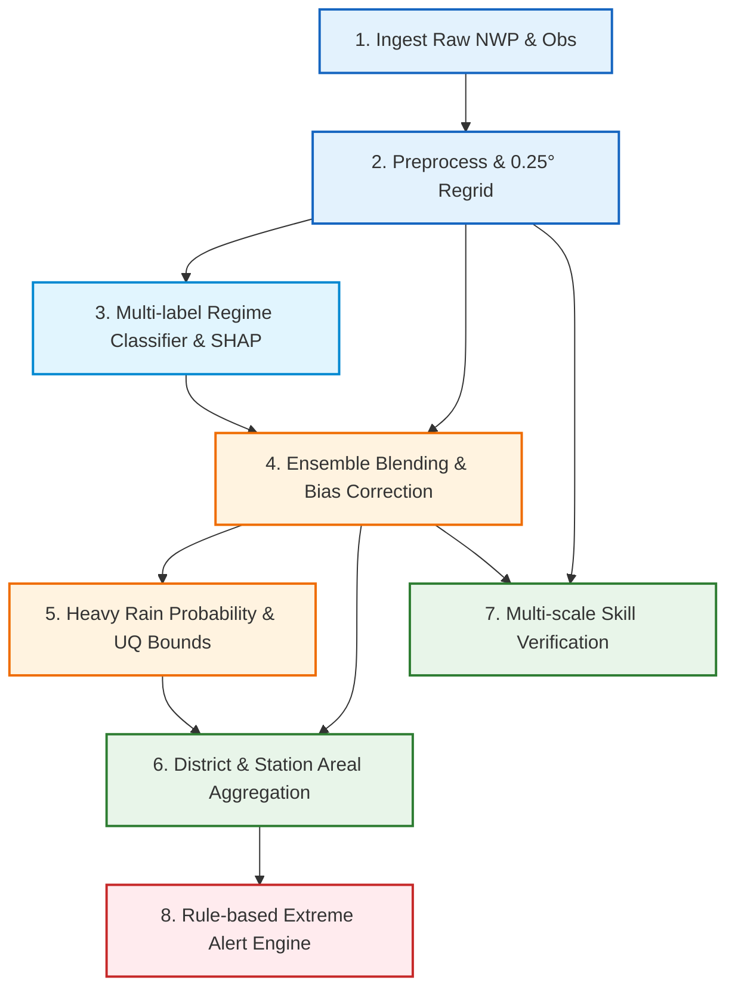

# ⚙️ Pipeline Execution & Operational Guide

The **PS-80 Master Pipeline** (`run_pipeline.py`) orchestrates the complete end-to-end meteorological data processing, artificial intelligence inference, numerical post-processing, and verification workflow.

This document details the architecture, input/output data contracts, CLI parameters, and operational maintenance for each of the 8 pipeline stages.

---

## 📋 Table of Contents
- [Pipeline Topology & Overview](#-pipeline-topology--overview)
- [CLI Options & Usage](#-cli-options--usage)
- [Deep-Dive into the 8 Stages](#-deep-dive-into-the-8-stages)
  - [Stage 1: Ingestion (`ingest`)](#stage-1-ingestion-ingest)
  - [Stage 2: Preprocessing (`preprocess`)](#stage-2-preprocessing-preprocess)
  - [Stage 3: Regime Classifier (`classifier`)](#stage-3-regime-classifier-classifier)
  - [Stage 4: Bias Correction (`correction`)](#stage-4-bias-correction-correction)
  - [Stage 5: Probability & Uncertainty (`probability`)](#stage-5-probability--uncertainty-probability)
  - [Stage 6: District & Station Aggregation (`aggregate`)](#stage-6-district--station-aggregation-aggregate)
  - [Stage 7: Verification & Skill Scores (`verify`)](#stage-7-verification--skill-scores-verify)
  - [Stage 8: Extreme Alerts Engine (`alerts`)](#stage-8-extreme-alerts-engine-alerts)
- [Configuration Reference (`config.yaml` vs `config.test.yaml`)](#-configuration-reference)
- [Troubleshooting & Common Failure Modes](#-troubleshooting--common-failure-modes)

---

## 🔄 Pipeline Topology & Overview

The 8 stages run sequentially, strictly honoring data dependencies:



---

## 💻 CLI Options & Usage

The master runner is invoked via Python:

```bash
python run_pipeline.py [OPTIONS]
```

### Supported Command-Line Arguments:
| Argument | Type | Default | Description |
|---|---|---|---|
| `--config` | `string` | `config.yaml` | Path to pipeline YAML configuration file |
| `--stage` | `string` | `None` (Runs all) | Target a single stage: `ingest`, `preprocess`, `classifier`, `correction`, `probability`, `aggregate`, `verify`, `alerts` |
| `--force` | `flag` | `False` | Force re-ingestion and overwrite raw files even if checksum manifest matches |
| `--dry-run` | `flag` | `False` | Log planned execution stages and parameter paths without executing any compute |

### Execution Examples:
```bash
# Run full pipeline with production configuration
python run_pipeline.py --config config.yaml

# Run test pipeline with rapid fixture data
python run_pipeline.py --config config.test.yaml

# Run only the regime classifier and SHAP attribution stage
python run_pipeline.py --config config.test.yaml --stage classifier

# Run only district aggregation and verification
python run_pipeline.py --config config.test.yaml --stage aggregate
python run_pipeline.py --config config.test.yaml --stage verify
```

---

## 🔍 Deep-Dive into the 8 Stages

### Stage 1: Ingestion (`ingest`)
- **Package**: `src.ingest`
- **Owner**: Track A (Pradeep)
- **Purpose**: Ingests multi-source NWP forecasts (e.g. NCMRWF NCUM, IMD GFS, ECMWF open data), observation grids, CartoDEM elevation tiles, station metadata, and district polygons.
- **Input**: External remote URLs, Bhuvan/CartoDEM APIs, or local repository fixtures.
- **Outputs Produced**:
  - `data/raw/manifest.json` (SHA-256 integrity checksums)
  - `data/raw/nwp_raw_*.nc`
  - `data/raw/obs_raw.nc`
  - `data/raw/topography/cartodem.tif`

---

### Stage 2: Preprocessing (`preprocess`)
- **Package**: `src.preprocess`
- **Owner**: Track A (Pradeep)
- **Purpose**:
  1. Spatially regrids all atmospheric variables onto a unified 0.25° x 0.25° latitude-longitude grid across India (`6.0°N–38.0°N`, `68.0°E–98.0°E`).
  2. Computes long-term day-of-year rainfall climatology (`climatology.nc`).
  3. Extracts 10 daily dynamical & thermodynamical features (`features_daily.csv`): MSLP anomaly, OLR anomaly, 850hPa zonal wind shear, precipitable water, low-pressure system flag, etc.
  4. Generates multi-label regime ground truth labels (`regime_labels.csv`).
- **Outputs Produced**:
  - `data/processed/nwp_grid_<source>.nc`
  - `data/processed/obs_grid.nc`
  - `data/processed/climatology.nc`
  - `data/processed/features_daily.csv`
  - `data/processed/regime_labels.csv`
  - `data/processed/station_obs.csv`

---

### Stage 3: Regime Classifier (`classifier`)
- **Package**: `src.regime_classifier`
- **Owner**: Track A (Pradeep)
- **Purpose**: Trains a multi-label LightGBM classifier across 6 distinct monsoon synoptic regimes:
  1. `active` (Monsoon trough south of normal position)
  2. `break` (Trough shifted north toward Himalayan foothills)
  3. `low_depression` (Organized cyclonic vortex in Bay of Bengal / Arabian Sea)
  4. `western_disturbance` (Mid-latitude upper-tropospheric trough in Northwest India)
  5. `orographic` (Western Ghats & Northeast topography enhancement)
  6. `coastal` (Offshore trough & coastal convergence)
- **Explainability**: Uses TreeSHAP to compute exact per-feature contributions for every daily prediction.
- **Outputs Produced**:
  - `data/processed/regime_predictions.csv` (Probabilities per regime, `dominant_label`, and `confidence`)
  - `src/regime_classifier/EVAL.md` (Precision, Recall, F1 scores)
  - `src/regime_classifier/explanations/*.csv` (Daily TreeSHAP feature attributions)

---

### Stage 4: Bias Correction (`correction`)
- **Package**: `src.bias_correction`
- **Owner**: Track B (Baljeet)
- **Purpose**:
  1. Fuses multi-model NWP members into an ensemble-weighted forecast (`ensemble_grid.nc`).
  2. Applies regime-conditioned Quantile Mapping (QM) and LightGBM spatial-residual correction (`corrected_grid.nc`).
  3. Conducts independent historical analog search using atmospheric similarity metrics (`analog_correction.nc`).
- **Outputs Produced**:
  - `data/processed/ensemble_grid.nc`
  - `data/processed/corrected_grid.nc`
  - `data/processed/correction_method_log.csv`
  - `data/processed/analog_correction.nc`

---

### Stage 5: Probability & Uncertainty (`probability`)
- **Package**: `src.heavy_rain_prob`
- **Owner**: Track B (Baljeet)
- **Purpose**: Computes calibrated exceedance probabilities for IMD standard rainfall categories:
  - Heavy Rainfall: **`>= 64.5 mm`**
  - Very Heavy Rainfall: **`>= 115.6 mm`**
  - Uncertainty Bounds: Derives 90% confidence intervals `[p_lower, p_upper]` via ensemble dispersion and calibrated quantile regression.
- **Outputs Produced**:
  - `data/processed/heavy_rain_prob.nc` (Variables: `p_heavy`, `p_very_heavy`, `p_heavy_lower`, `p_heavy_upper`, `p_very_heavy_lower`, `p_very_heavy_upper`)
  - `src/heavy_rain_prob/CALIBRATION.md` (Brier score & reliability diagrams)

---

### Stage 6: District & Station Aggregation (`aggregate`)
- **Package**: `src.district_agg`
- **Owner**: Track C (Divyansh)
- **Purpose**:
  1. Intersects gridded predictions with district administrative boundaries to compute area-weighted mean rainfall, maximum point rainfall, and exceedance probability.
  2. Extracts point predictions at official IMD station locations (`station_table.csv`).
- **Outputs Produced**:
  - `outputs/district_table.csv`
  - `outputs/station_table.csv`

---

### Stage 7: Verification & Skill Scores (`verify`)
- **Package**: `src.verification`
- **Owner**: Track C (Divyansh)
- **Purpose**: Evaluates forecast accuracy against actual observations:
  - Continuous Metrics: Root Mean Squared Error (RMSE), Mean Absolute Error (MAE), Correlation ($r$).
  - Categorical Contingency Metrics: Probability of Detection (POD), False Alarm Ratio (FAR), Critical Success Index (CSI), Equitable Threat Score (ETS).
  - Spatial Verification: Multi-scale Fractions Skill Score (FSS) across 25km, 50km, and 100km radii.
- **Outputs Produced**:
  - `outputs/verification_report/metrics_summary.csv`
  - `outputs/verification_report/regime_breakdown.csv`
  - `outputs/verification_report/REPORT.md`

---

### Stage 8: Extreme Alerts Engine (`alerts`)
- **Package**: `src.alerts`
- **Owner**: Track C (Divyansh)
- **Purpose**: Evaluates district predictions against multi-tier IMD alert thresholds:
  - 🔴 **Red Alert (Warning)**: $P(\ge 115.6\text{ mm}) \ge 0.50$ OR Predicted Rainfall $\ge 204.5\text{ mm}$
  - 🟠 **Orange Alert (Watch)**: $P(\ge 64.5\text{ mm}) \ge 0.60$ OR $P(\ge 115.6\text{ mm}) \ge 0.30$
  - 🟡 **Yellow Alert (Advisory)**: $P(\ge 64.5\text{ mm}) \ge 0.30$
- **Outputs Produced**:
  - `outputs/alerts_log/alerts.json` (Structured JSON payload for downstream dispatch)
  - `outputs/alerts_log/alerts_summary.csv` (Tabular alert digest)

---

## ⚙️ Configuration Reference

The pipeline is fully parameterized using YAML.

| Configuration Field | `config.yaml` (Production) | `config.test.yaml` (Testing) | Description |
|---|---|---|---|
| `domain.lat_min` / `lat_max` | `6.0` / `38.0` | `15.0` / `25.0` | Bounding latitude limits (°N) |
| `domain.lon_min` / `lon_max` | `68.0` / `98.0` | `73.0` / `85.0` | Bounding longitude limits (°E) |
| `domain.resolution` | `0.25` | `0.25` | Grid resolution in degrees |
| `dates.start_date` / `end_date` | `2018-06-01` / `2024-09-30` | `2024-07-01` / `2024-07-10` | Date interval for pipeline processing |
| `thresholds.very_heavy_mm` | `115.6` | `115.6` | Official IMD very-heavy threshold standard |
| `thresholds.heavy_mm` | `64.5` | `64.5` | Official IMD heavy threshold standard |

---

## 🛠️ Troubleshooting & Common Failure Modes

### 1. `Stage 1 ingest [FAIL]` or missing input files
- Ensure internet connectivity or provide local fixture paths in config.
- If testing locally, run with `config.test.yaml` which automatically loads pre-bundled test fixtures.

### 2. `NameError: name 'n_test' is not defined`
- Occurs if `src/regime_classifier/evaluate.py` has inconsistent variable scoping during test evaluation.
- Resolved in the current codebase by calculating `n_test = len(X_test)` prior to evaluating splits.

### 3. NetCDF Dimension Mismatch
- All grids (`nwp_grid_*.nc`, `obs_grid.nc`, `climatology.nc`) must strictly match `(date, lat, lon)`.
- If custom raw data has inverted latitudes (`lat` decreasing from 90 to -90), `src/preprocess` automatically flips the latitude dimension to ascending order.
