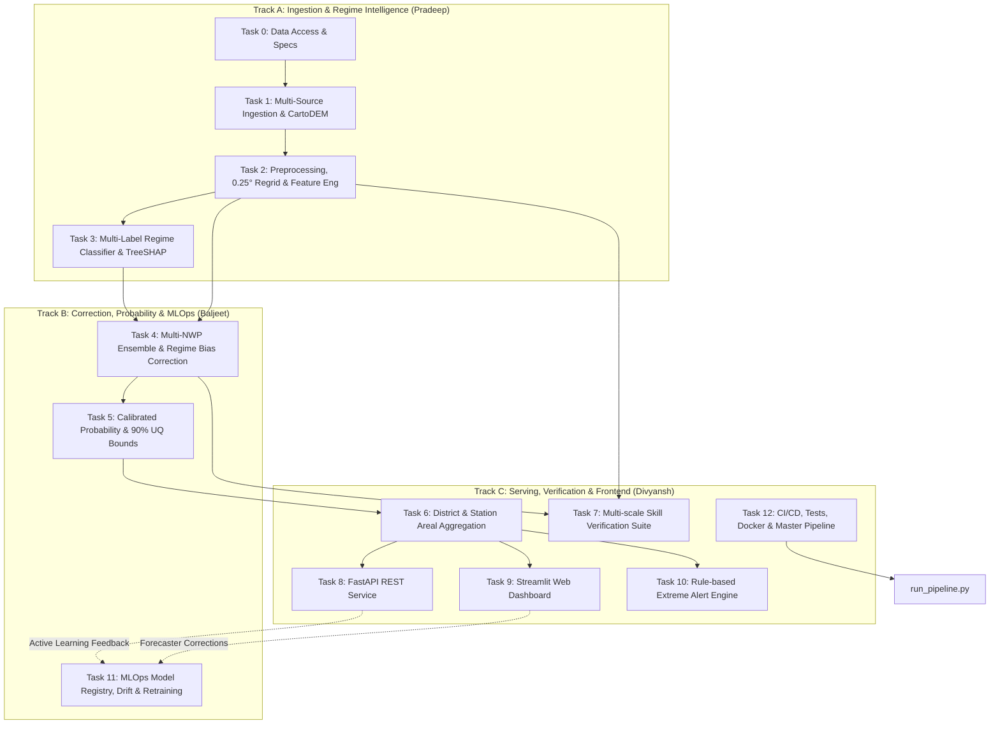

# 🧠 PS-80 (SIH 2026) — Complete System & Domain Knowledge Base
> **Universal Agent Context Document**: Provide this document to any AI agent, researcher, developer, or domain evaluator to enable instant, accurate, and deep understanding of every theoretical, technical, operational, and architectural aspect of this project.

---

## 📌 1. Executive Summary & Problem Formulation

### 1.1 Problem Statement Details
- **Code / Title**: PS-80 / PS 26080 — *Regime-Aware AI Post-Processing of Monsoon Rainfall Forecasts*.
- **Initiative**: Smart India Hackathon (SIH) 2026.
- **Nodal Stakeholders**: Ministry of Earth Sciences (MoES), India Meteorological Department (IMD), National Centre for Medium Range Weather Forecasting (NCMRWF).
- **Primary Objective**: Build an operational, end-to-end, regime-conditioned AI post-processing system that ingests raw Numerical Weather Prediction (NWP) forecasts and atmospheric observations, identifies prevailing synoptic weather regimes with explainability, corrects systematic NWP rainfall biases, quantifies heavy rainfall probability with calibrated uncertainty bounds, aggregates forecasts to district and station levels, verifies skill against observations, generates extreme rainfall alerts, and continuously improves via forecaster feedback.

### 1.2 The Core Scientific Challenge
Modern numerical weather prediction models (e.g. NCMRWF Unified Model [NCUM], IMD Global Forecast System [GFS], and ECMWF Integrated Forecasting System [IFS]) exhibit significant, non-linear, spatial and regime-dependent forecast errors:
1. **Convective Under-prediction & Over-smoothing**: Raw physics parameterizations often smear convective rainfall over wide areas or fail to capture localized cloudbursts.
2. **Orographic Bias**: Strong positive rainfall biases on the windward slopes of the Western Ghats and Himalayan foothills, accompanied by dry biases in the leeward rain-shadow zones.
3. **Synoptic Regime Sensitivity**: Bias characteristics invert between synoptic regimes. An active monsoon trough produces different error distributions than a break monsoon, an offshore trough, a monsoon depression, or a Western Disturbance.
4. **Failure of Naive Post-Processing**: Traditional "one-size-fits-all" post-processing (such as global linear regression or unconditioned Model Output Statistics [MOS]) fails because the underlying atmospheric error dynamics fundamentally change with the weather regime.

### 1.3 The Solution Architecture
Instead of applying a single monolithic correction model, this system:
1. Detects multi-label synoptic weather regimes using a fused multi-sensor feature space with TreeSHAP explainability.
2. Dynamically routes forecasts to regime-specific correction engines (Quantile Mapping + Gradient Boosted Residual Modeling + Historical Analogs).
3. Produces calibrated exceedance probabilities for IMD standard extreme rainfall thresholds with 90% confidence intervals.
4. Aggregates results to administrative district and ground station levels.
5. Verifies multi-scale forecast skill across regimes and spatial scales (FSS).
6. Serves predictions via high-performance REST APIs and a dual-layer interactive GIS dashboard.
7. Logs forecaster feedback for active-learning model drift monitoring and retraining.

---

## 👥 2. Team Split, Governance & Data Contracts

The codebase strictly enforces modular architecture and clear separation of concerns across three parallel tracks:



### 2.1 Track A — Pradeep (Ingestion & Regime Intelligence)
- **Directory Scope**: `src/ingest/`, `src/preprocess/`, `src/regime_classifier/`, `data/raw/`, `data/processed/features_daily.csv`, `data/processed/regime_*.csv`.
- **Key Responsibilities**:
  - Ingestion of multiple NWP models (GFS, NCUM), observational rainfall grids, station records, ISRO Bhuvan CartoDEM 30m elevation, and synoptic flags.
  - Regridding all gridded atmospheric data onto a standard **0.25° x 0.25°** grid over India (`6.0°N–38.0°N`, `68.0°E–98.0°E`).
  - Engineering 10 daily dynamical, thermodynamical, and satellite proxy features.
  - Training multi-label LightGBM classifier for 6 monsoon regimes with TreeSHAP attribution.

### 2.2 Track B — Baljeet (Ensemble Fusion, Bias Correction, UQ & MLOps)
- **Directory Scope**: `src/bias_correction/`, `src/heavy_rain_prob/`, `src/uncertainty/`, `src/mlops/`.
- **Key Responsibilities**:
  - Blending multi-NWP members using dynamic variance-weighted ensemble averaging.
  - Regime-conditioned Quantile Mapping (QM) and LightGBM spatial residual correction.
  - Independent historical analog-based correction pathway using atmospheric Euclidean distance.
  - Calibrated exceedance probability modeling ($P \ge 64.5\text{ mm}$ and $P \ge 115.6\text{ mm}$) with 90% confidence bounds ($[p_{\text{lower}}, p_{\text{upper}}]$).
  - MLOps model registry, drift monitoring (Kolmogorov-Smirnov / PSI tests), and active learning retraining pipeline.

### 2.3 Track C — Divyansh (Aggregation, Verification, Serving, UI & Ops)
- **Directory Scope**: `src/district_agg/`, `src/verification/`, `src/alerts/`, `api/`, `dashboard/`, `infra/`, `tests/`, `run_pipeline.py`.
- **Key Responsibilities**:
  - Intersecting gridded fields with district shapefiles for area-weighted mean/max precipitation.
  - Extracting point forecasts at official IMD ground station coordinates.
  - Verification suite: Continuous metrics (RMSE, MAE, Correlation), categorical contingency scores (ETS, CSI, POD, FAR), multi-scale Fractions Skill Score (FSS at 25km, 50km, 100km), and reliability diagrams.
  - FastAPI backend exposing 14 REST endpoints.
  - Streamlit dashboard featuring custom white-and-blue UI, Folium map with OpenStreetMap vs Satellite tile toggle, TreeSHAP explainer, skill charts, and feedback logger.
  - Rule-based alerting engine according to official IMD color protocols.
  - Master pipeline orchestrator (`run_pipeline.py`), Docker Compose, and test suite.

---

## 🌪️ 3. Meteorological & Theoretical Foundations

### 3.1 The 6 Synoptic Monsoon Regimes
The Indian summer monsoon (June–September) is governed by distinct large-scale synoptic patterns. The system classifies six non-mutually exclusive regimes:

| Regime Key | Synoptic Definition | Meteorological Indicators & Thresholds | Typical NWP Bias Tendency |
|---|---|---|---|
| `active` | Active Monsoon | Monsoon trough south of normal position; strong low-level westerly jet across Arabian Sea; high precipitable water; negative MSLP anomaly in Central India. | Over-predicts widespread light rain; under-predicts embedded mesoscale convective maxima. |
| `break` | Break Monsoon | Monsoon trough shifts north to Himalayan foothills; rainfall ceases over central India; heavy precipitation confined to foothills and northeast India. | Delayed onset of break; fails to shut down rainfall over central peninsula. |
| `low_depression` | Monsoon Low / Depression | Synoptic cyclonic vortex originating in Bay of Bengal / Arabian Sea ($1000\text{–}2000\text{ km}$ scale); strong vorticity; intense convective bands. | Positional track error (50–150 km); under-predicts core rain intensity. |
| `western_disturbance` | Western Disturbance | Mid-latitude upper-tropospheric trough embedded in subtropical westerlies traversing Northwest India, triggering unseasonal extreme rainfall and hail. | Timing offsets; misrepresentation of subtropical westerly jet interaction. |
| `orographic` | Orographic Enhancement | Strong moisture-laden winds forced up steep topography (Western Ghats, Meghalaya plateau, Himalayas). | Excessive windward crest precipitation; over-diffusion across ridge into rain-shadow. |
| `coastal` | Coastal / Offshore Trough | Trough of low pressure off the West Coast of India (Goa, Karnataka, Kerala); intense localized coastal convergence. | Under-prediction of localized near-shore rainfall bands. |

### 3.2 Why Multi-Label Classification?
Atmospheric dynamics are rarely single-mode. A given day can feature a **Monsoon Depression** moving over Odisha while simultaneously experiencing **Orographic Enhancement** along the Western Ghats and an **Offshore Trough** along the Konkan coast. Multi-label LightGBM models independent binary probabilities for each regime, allowing the system to recognize compound weather events.

### 3.3 The 10 Daily Engineered Atmospheric Features
Features extracted daily across the domain from NWP and reanalysis fields:
1. `mslp_anomaly`: Domain mean sea-level pressure departure from climatology (hPa).
2. `olr_anomaly`: Outgoing Longwave Radiation anomaly ($\text{W/m}^2$, proxy for deep convection).
3. `wind_shear_850_200`: Zonal wind shear between 850 hPa and 200 hPa ($\text{m/s}$).
4. `precipitable_water`: Column-integrated water vapor ($\text{kg/m}^2$ or mm).
5. `vorticity_850`: Low-level relative vorticity at 850 hPa ($10^{-5}\text{ s}^{-1}$).
6. `trough_lat_departure`: Latitude of monsoon trough axis relative to normal ($21^\circ\text{N}$).
7. `western_ghats_flux`: Cross-barrier moisture flux perpendicular to the Western Ghats.
8. `himalayan_foothills_anomaly`: Local rainfall anomaly over $27^\circ\text{–}32^\circ\text{N}$.
9. `lps_flag`: Binary indicator (1/0) of low pressure system / depression presence from IMD tracks.
10. `wd_flag`: Binary indicator (1/0) of active Western Disturbance over Northwest India.

### 3.4 Bias Correction Methodologies
The system implements three complementary, interchangeable correction pathways:
1. **Regime-Conditioned Quantile Mapping (QM)**:
   - For regime $r$, constructs cumulative distribution functions $F_{\text{NWP}, r}(x)$ and $F_{\text{OBS}, r}(y)$.
   - Forecast correction: $\hat{y} = F_{\text{OBS}, r}^{-1}\left(F_{\text{NWP}, r}(x_{\text{raw}})\right)$.
   - Removes systematic distributional skew and heavy-tail suppression.
2. **Gradient Boosted Machine (GBM) Residual Correction**:
   - A LightGBM regressor trained to predict point residual error $\Delta = y_{\text{obs}} - x_{\text{nwp}}$ conditioned on raw rainfall, regime probabilities, elevation (CartoDEM), distance to coast, and synoptic anomalies.
   - Final forecast: $\hat{y} = \max(0, x_{\text{raw}} + \hat{\Delta})$.
3. **Historical Analog Search**:
   - Computes normalized Euclidean distance between current feature vector $\mathbf{z}_t$ and historical feature vectors $\mathbf{z}_\tau$ within the same regime.
   - Selects top $K$ closest historical analog days and computes empirical error distribution to adjust the forecast.

### 3.5 IMD Standard Precipitation Thresholds
All thresholds in the system strictly conform to India Meteorological Department classifications:
- **No Rain**: $< 0.1\text{ mm/24h}$
- **Very Light Rain**: $0.1\text{–}2.4\text{ mm/24h}$
- **Light Rain**: $2.5\text{–}15.5\text{ mm/24h}$
- **Moderate Rain**: $15.6\text{–}64.4\text{ mm/24h}$
- **Heavy Rain**: **`>= 64.5 mm/24h`**
- **Very Heavy Rain**: **`>= 115.6 mm/24h`** *(strictly standardized project-wide; note: >= 115.6 mm represents the exact lower boundary of IMD Very Heavy Rainfall)*
- **Extremely Heavy Rain**: **`>= 204.5 mm/24h`**

### 3.6 Spatial & Probabilistic Verification Metrics
- **Continuous**: RMSE, MAE, Pearson Correlation ($r$).
- **Categorical (Contingency Table)**:
  - Hits ($H$), False Alarms ($F$), Misses ($M$), Correct Negatives ($C$).
  - **Probability of Detection (POD)**: $\frac{H}{H + M}$
  - **False Alarm Ratio (FAR)**: $\frac{F}{H + F}$
  - **Critical Success Index (CSI)**: $\frac{H}{H + F + M}$
  - **Equitable Threat Score (ETS)**: $\frac{H - H_{\text{random}}}{H + F + M - H_{\text{random}}}$ where $H_{\text{random}} = \frac{(H+M)(H+F)}{N}$
- **Spatial Neighborhood Verification**:
  - **Fractions Skill Score (FSS)**: Evaluates spatial fractional coverage within neighborhood radius $r \in \{25\text{km}, 50\text{km}, 100\text{km}\}$ to avoid the "double penalty" problem of high-resolution models.
  - $\text{FSS} = 1 - \frac{\text{MSE}_{(r)}}{\text{MSE}_{(r),\text{ref}}}$. FSS ranges from 0 (no skill) to 1 (perfect spatial match).
- **Probabilistic Calibration**:
  - Reliability curves plotting forecast probability bins against observed frequency.
  - Brier Score (BS) decomposition: $\text{BS} = \text{Reliability} - \text{Resolution} + \text{Uncertainty}$.

---

## 💻 4. Technical Architecture & File Contracts

### 4.1 Master Directory Structure
```text
PS-80-SIH-2026/
├── .streamlit/config.toml          # Custom Streamlit UI theme (White & Blue)
├── api/
│   ├── main.py                     # FastAPI application entrypoint (14 REST endpoints)
│   ├── schemas.py                  # Pydantic request/response schemas
│   └── data_loader.py              # Cached data access layer and CartoDEM validator
├── dashboard/
│   ├── web/app.py                  # Main Streamlit dashboard (Tabs: Forecast, Regime, Skill, Alerts)
│   └── components/
│       ├── alert_panel.py          # Alert summary table and bulletin cards
│       ├── map_component.py        # Folium choropleth with OpenStreetMap & Satellite switcher
│       ├── regime_explainer.py     # TreeSHAP waterfall and bar chart visualization
│       └── skill_charts.py         # Plotly continuous and categorical skill benchmarks
├── data/
│   ├── raw/                        # Ingested NetCDF files, shapefiles, manifest.json
│   ├── processed/                  # NetCDF grids, features_daily.csv, regime_predictions.csv
│   └── external/                   # District shapefiles, station coordinates
├── docs/                           # Comprehensive technical documentation suite
│   ├── README.md                   # Documentation portal index
│   ├── architecture.md             # System architecture & Mermaid topologies
│   ├── api_reference.md            # Detailed REST API specification
│   ├── user_guide.md               # Forecaster operational manual
│   ├── DEPLOYMENT.md               # Docker, VM, Systemd, Nginx, SSL deployment guide
│   ├── PIPELINE_GUIDE.md           # 8-stage pipeline execution manual
│   └── PROJECT_CONTEXT.md          # Universal AI Knowledge Base (this document)
├── infra/docker/
│   ├── Dockerfile                  # Production container definition
│   └── docker-compose.yml          # Multi-container orchestration (API + Dashboard)
├── outputs/
│   ├── district_table.csv          # District aggregated rainfall, probabilities, uncertainty
│   ├── station_table.csv           # Station point forecasts and 90% confidence intervals
│   ├── verification_report/        # Full metrics summary, FSS, and regime breakdown
│   ├── alerts_log/                 # Generated alerts.json and alerts_summary.csv
│   └── feedback/                   # Forecaster feedback log (JSONL)
├── src/
│   ├── alerts/                     # Rule-based extreme event alert engine
│   ├── bias_correction/            # Multi-NWP QM, ML GBM corrector, and analog search
│   ├── district_agg/               # Zonal district and station point aggregator
│   ├── explainability/             # TreeSHAP synoptic and correction attributions
│   ├── heavy_rain_prob/            # Calibrated exceedance probability and 90% UQ
│   ├── ingest/                     # Multi-source NWP, reanalysis, and CartoDEM ingestion
│   ├── mlops/                      # Drift monitoring, feedback loop, and model registry
│   ├── preprocess/                 # Regridding, climatology, and regime ground-truth
│   ├── regime_classifier/          # Multi-label LGBM regime classifier and evaluator
│   └── verification/               # RMSE, ETS, CSI, FSS, and reliability metrics
├── tests/
│   ├── fixtures/                   # Test data fixture generator & mini-NetCDF files
│   ├── integration/                # End-to-end pipeline and API integration tests
│   └── unit/                       # Component-level unit test suites
├── config.yaml                     # Production pipeline configuration
├── config.test.yaml                # Lightweight test fixture configuration
├── run_pipeline.py                 # Master pipeline orchestrator (Stages 1–8)
└── requirements.txt                # Python dependencies
```

### 4.2 Exact File & Data Contracts
Every component communicates strictly through persistent disk artifacts:
1. `data/processed/nwp_grid_<source>.nc`: Gridded raw forecast. Dims: `(date, lat, lon)`. Variable: `precip_mm`.
2. `data/processed/obs_grid.nc`: Gridded observation. Dims: `(date, lat, lon)`. Variable: `precip_mm`.
3. `data/processed/climatology.nc`: Long-term day-of-year mean. Variable: `precip_mm_clim`.
4. `data/processed/features_daily.csv`: 10 daily atmospheric features. Columns: `date, mslp_anomaly, olr_anomaly, wind_shear_850_200, ...`
5. `data/processed/regime_predictions.csv`: Model inferences. Columns: `date, active_prob, break_prob, low_depression_prob, western_disturbance_prob, orographic_prob, coastal_prob, dominant_label, confidence`.
6. `data/processed/corrected_grid.nc`: AI post-processed rainfall. Variable: `precip_mm_corrected`.
7. `data/processed/heavy_rain_prob.nc`: Exceedance probabilities. Variables: `p_heavy`, `p_very_heavy`, `p_heavy_lower`, `p_heavy_upper`, `p_very_heavy_lower`, `p_very_heavy_upper`.
8. `outputs/district_table.csv`: Zonal district forecasts. Columns: `district_name, date, corrected_rainfall_mm, rainfall_category, p_heavy, p_very_heavy, uncertainty_lower, uncertainty_upper, dominant_regime, regime_confidence, correction_method`.
9. `outputs/station_table.csv`: Point predictions at AWS/IMD stations.
10. `outputs/alerts_log/alerts.json`: JSON payload containing active warnings, risk levels, and meteorologist rationale.

---

## 🚀 5. Pipeline Orchestration & CLI

The master runner [run_pipeline.py](file:///c:/Users/asus/Desktop/ps%2080%203/PS-80-SIH-2026/run_pipeline.py) chains all 8 stages sequentially:

```bash
python run_pipeline.py --config config.yaml
```

### The 8 Stages:
1. `ingest` (`src.ingest.run`): Fetches raw NWP, satellite, station, and ISRO CartoDEM data.
2. `preprocess` (`src.preprocess.run`): Performs 0.25° regridding, climatology calculation, feature extraction, and regime labeling.
3. `classifier` (`src.regime_classifier.run`): Trains multi-label LightGBM, evaluates held-out metrics, infers regime probabilities, and generates TreeSHAP feature attributions.
4. `correction` (`src.bias_correction.run`): Fuses multi-model NWP into ensemble mean, applies regime-specific Quantile Mapping and ML residual correction, and computes analog adjustments.
5. `probability` (`src.heavy_rain_prob.run`): Calculates calibrated exceedance probabilities for $\ge 64.5\text{ mm}$ and $\ge 115.6\text{ mm}$ with 90% confidence uncertainty intervals.
6. `aggregate` (`src.district_agg.run`): Aggregates gridded fields to district boundaries and station locations.
7. `verify` (`src.verification.run`): Generates comprehensive verification report comparing raw, ensemble, and corrected forecasts across metrics and scales.
8. `alerts` (`src.alerts.run`): Evaluates district predictions against multi-tier IMD rules and writes alert logs.

### Command-Line Arguments:
- `--config <path>`: Specify configuration file (default: `config.yaml`, testing: `config.test.yaml`).
- `--stage <name>`: Execute only a single stage (e.g. `--stage classifier` or `--stage verify`).
- `--force`: Force re-download and re-computation of raw ingestion artifacts.
- `--dry-run`: Inspect planned execution sequence without writing files.

---

## 🔌 6. REST API Reference (FastAPI)

The API layer is hosted on port `8000`. Full interactive OpenAPI Swagger documentation is available at `http://localhost:8000/docs`.

| Method | Endpoint | Description | Query Parameters |
|---|---|---|---|
| `GET` | `/api/v1/health` | Service liveness probe and stage availability | None |
| `GET` | `/api/v1/meta` | System metadata, date bounds, and domain resolution | None |
| `GET` | `/api/v1/topography/cartodem` | ISRO Bhuvan CartoDEM key status & elevation stats | None |
| `GET` | `/api/v1/districts/{date}` | Zonal district forecasts, categories & probabilities | `date` (YYYY-MM-DD) |
| `GET` | `/api/v1/districts` | Filterable district time series | `district_name`, `start_date`, `end_date` |
| `GET` | `/api/v1/stations/{date}` | Station point forecasts with 90% UQ intervals | `date` (YYYY-MM-DD) |
| `GET` | `/api/v1/stations` | Filterable station time series | `station_id`, `start_date`, `end_date` |
| `GET` | `/api/v1/regime/{date}` | Synoptic regime probabilities & dominant label | `date` (YYYY-MM-DD) |
| `GET` | `/api/v1/regime` | Historical synoptic regime classifications | `start_date`, `end_date` |
| `GET` | `/api/v1/alerts` | Active extreme rainfall warning bulletins | `min_severity` (INFO, WARNING, CRITICAL) |
| `GET` | `/api/v1/verification/summary`| Continuous & categorical verification summary | `model` (raw, ensemble, corrected) |
| `GET` | `/api/v1/verification/fss` | Multi-scale Fractions Skill Score by radius | `threshold_mm` |
| `GET` | `/api/v1/verification/reliability`| Reliability diagram curve data | `threshold_mm` |
| `GET` | `/api/v1/verification/regime` | Verification metrics broken down by synoptic regime | None |
| `POST`| `/api/v1/feedback` | Ingest forecaster corrections for active learning | JSON body: `FeedbackItem` |
| `POST`| `/api/v1/cache/clear` | Clear in-memory caches after new pipeline runs | None |

---

## 🎨 7. Interactive Dashboard & UI Design

Hosted via Streamlit on port `8501`. Designed with a modern, professional, high-contrast **White and Blue** color palette (`#1E88E5` accent, `#F8FAFC` background) suited for operational meteorological centers:

### Tabs & Capabilities:
1. **🗺️ District Forecast Map**:
   - Interactive Folium choropleth of Indian districts.
   - Dual-tile layer switcher: **OpenStreetMap Standard** vs **ESRI High-Resolution World Imagery Satellite**.
   - Hover tooltips and click popups displaying predicted rainfall, IMD category, $P(\ge 64.5\text{ mm})$, $P(\ge 115.6\text{ mm})$, and $[10\%, 90\%]$ uncertainty intervals.
2. **🧠 Synoptic Regime & Explainability**:
   - Active regime cards showing confidence percentages.
   - Interactive TreeSHAP feature attribution waterfall and bar plots explaining *why* the AI made the classification (e.g. MSLP anomaly depression of -6.2 hPa contributed +34% to `low_depression`).
3. **📊 Skill & Verification**:
   - Side-by-side performance benchmarks (Raw NWP vs Ensemble vs AI-Corrected).
   - Multi-scale Fractions Skill Score (FSS) bar charts and reliability calibration curves.
4. **⚠️ Extreme Rainfall Alerts**:
   - Color-coded alert digest (🔴 Red, 🟠 Orange, 🟡 Yellow).
   - Form for operational forecasters to submit real-time corrections, triggering active learning feedback.

---

## 🧪 8. Testing & Quality Assurance

The codebase includes an automated test suite with **62 unit and integration tests**:

```bash
# Run all tests
python -m pytest -q

# Run with test coverage
python -m pytest --cov=src --cov=api
```

### Test Hierarchy:
- `tests/unit/test_ingest.py`: Multi-source manifest integrity, CartoDEM API fallback, NetCDF structure.
- `tests/unit/test_preprocess.py`: Spatial regridding, conservation of mass, climatology date matching.
- `tests/unit/test_regime_classifier.py`: Multi-label output shapes, TreeSHAP explainer generation, F1 scores.
- `tests/unit/test_bias_correction.py`: Monotonic quantile mapping, GBM residual bounds, analog similarity.
- `tests/unit/test_heavy_rain_prob.py`: Calibrated probabilities $\in [0, 1]$, uncertainty intervals ($p_{\text{lower}} \le p \le p_{\text{upper}}$).
- `tests/unit/test_district_agg.py`: Shapefile intersection, spatial weighting, missing station handling.
- `tests/unit/test_verification.py`: Verification score calculations (RMSE, ETS, CSI, POD, FAR, FSS).
- `tests/unit/test_alerts.py`: IMD threshold rule triggers and alert schema compliance.
- `tests/integration/test_full_pipeline.py`: End-to-end execution of all 8 stage wrappers in sequence.
- `tests/integration/test_api.py`: FastAPI endpoint responses, status codes, and schema validation.

---

## ❓ 9. Frequently Asked Technical & Domain Questions

### Q1: Why use LightGBM instead of Deep Learning (e.g. U-Net / ConvLSTM) for the regime classifier?
**Answer**:
1. **Explainability & Operational Trust**: Operational meteorologists at IMD/NCMRWF require transparent, auditable decisions. TreeSHAP provides exact, mathematically sound Shapley feature attributions in real time, which is significantly more difficult and computationally expensive with deep neural networks.
2. **Tabular Efficiency**: Daily domain-aggregated dynamical/thermodynamical features are tabular in nature. Gradient Boosted Trees consistently match or outperform deep networks on structured tabular data while training in seconds.
3. **Documented Upgrade Path**: The system is modular. A spatial CNN/ConvNeXt backbone can be swapped into `src/regime_classifier/model.py` by adhering to the established `regime_predictions.csv` output contract.

### Q2: How does the system handle CartoDEM elevation data?
**Answer**:
The system integrates with ISRO's National Remote Sensing Centre (NRSC) Bhuvan platform to access 1 arc-second (~30m) CartoDEM digital elevation models. High-resolution terrain height, slope, and aspect are sampled onto the 0.25° grid to condition orographic precipitation correction on windward versus leeward slope dynamics. If remote keys are absent, the system smoothly falls back to local high-resolution topographic fixtures.

### Q3: Why is the threshold for Very Heavy Rain strictly `>= 115.6 mm`?
**Answer**:
According to official IMD meteorological terminology, "Heavy Rain" spans $64.5\text{–}115.5\text{ mm/24h}$ and "Very Heavy Rain" begins strictly at **`115.6 mm/24h`** (extending up to $204.4\text{ mm/24h}$). Early prototypes occasionally used $115.5\text{ mm}$; the entire codebase has been strictly standardized to `>= 115.6 mm` to guarantee full scientific compliance with IMD standards.

### Q4: How is uncertainty quantified in the rainfall probability?
**Answer**:
Uncertainty quantification (UQ) does not rely on a heuristic guess. The system utilizes a dual-engine approach:
1. **Ensemble Spread**: The variance across multi-NWP models and analog candidates.
2. **Quantile Regression**: Training LightGBM pinball loss models at the 10th and 90th percentiles to establish empirical lower ($p_{\text{lower}}$) and upper ($p_{\text{upper}}$) prediction intervals, ensuring a calibrated 90% confidence envelope around every extreme rain probability.

### Q5: How does the active learning feedback loop work?
**Answer**:
When an operational duty forecaster identifies that an AI prediction is incorrect (e.g. classifying a day as `active` when synoptic satellite imagery indicates a `break` transition), the forecaster submits a correction through the dashboard or `/api/v1/feedback` REST endpoint. This correction is appended to `outputs/feedback/feedback_log.jsonl` following Track B's `feedback_schema.md`. The MLOps pipeline (`src/mlops/`) monitors drift and incorporates forecaster annotations as high-priority weighted samples during scheduled model retraining runs.

---

## 🏁 10. Quick-Start Command Cheat Sheet

```powershell
# 1. Activate Python Environment & Set Config
$env:CONFIG_PATH="config.test.yaml"
$env:CARTODEM_API_KEY="your_cartodem_key"
$env:BHUVAN_API_KEY="your_bhuvan_key"

# 2. Run Automated Test Suite (62 tests)
python -m pytest -q

# 3. Execute Master End-to-End Pipeline (Stages 1-8)
python run_pipeline.py --config config.test.yaml

# 4. Launch FastAPI REST Service
python -m uvicorn api.main:app --host 127.0.0.1 --port 8000 --reload

# 5. Launch Interactive Streamlit Dashboard
python -m streamlit run dashboard/web/app.py --server.port 8501

# 6. Deploy with Docker Compose
cd infra/docker
docker-compose up --build -d
```
