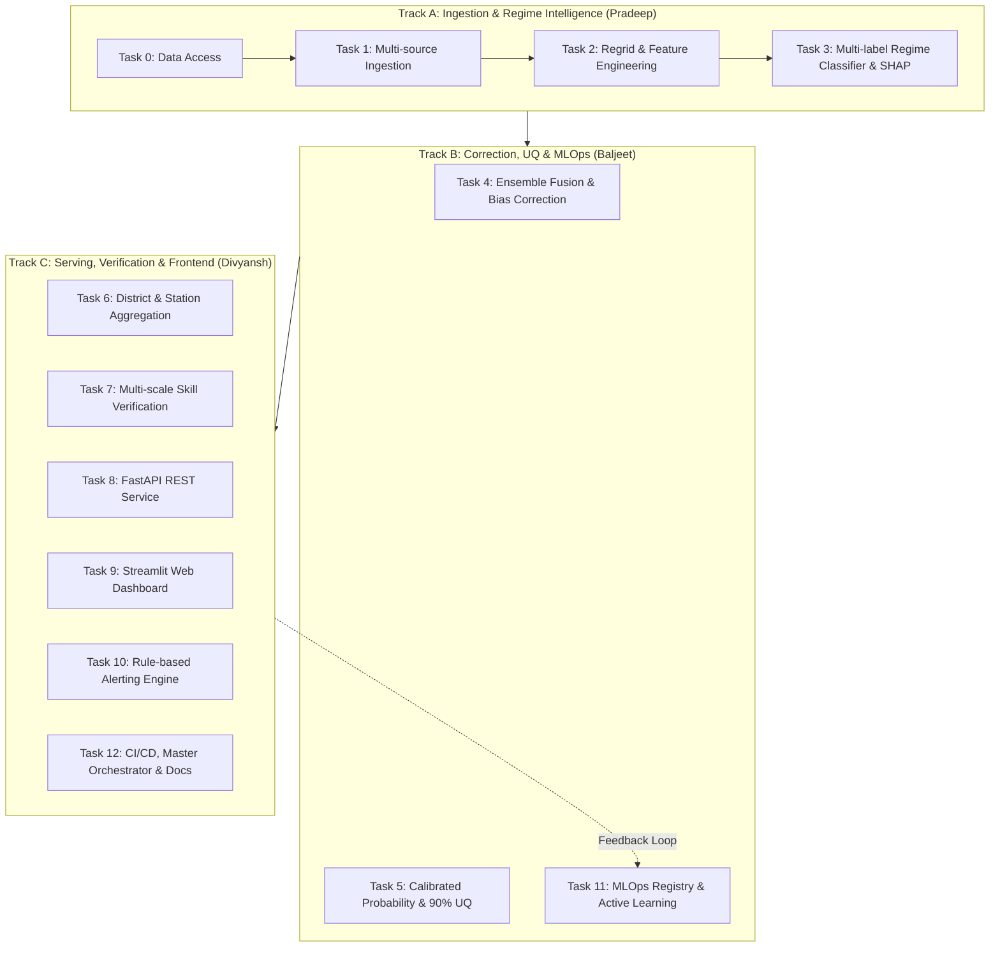

# 📚 PS-80 SIH 2026 Documentation Portal

Welcome to the comprehensive documentation suite for **PS-80: Regime-Aware AI Post-Processing of Monsoon Rainfall Forecasts**.

This directory contains technical architecture blueprints, operational user manuals, REST API references, deployment procedures, and pipeline guides.

---

## 🗂️ Documentation Navigation

| Document | Audience | Key Contents |
|---|---|---|
| 🏛️ **[System Architecture](architecture.md)** | Engineers & Architects | End-to-end dataflow, track boundaries, input/output contracts, and ML topologies. |
| 🔌 **[API Reference](api_reference.md)** | Developers & Integrators | Full REST API specification across all 14 endpoints (FastAPI, Swagger, schemas). |
| 📖 **[User Guide](user_guide.md)** | Forecasters & Operators | Step-by-step operational workflows, dashboard tab navigation, and alert tuning. |
| 🚀 **[Deployment Guide](DEPLOYMENT.md)** | DevOps & SysAdmins | Production deployment via Docker Compose, Cloud Virtual Machines, Nginx reverse proxy, and systemd. |
| ⚙️ **[Pipeline Execution Guide](PIPELINE_GUIDE.md)** | Data Scientists & Operators | Detailed breakdown of all 8 pipeline stages, CLI flags, data formats, and debugging. |

---

## 👥 Cross-Track Architecture Summary

The system is developed across three specialized tracks:



For complete team division of responsibilities, see [TEAM_SPLIT.md](../TEAM_SPLIT.md) and [PLAN.md](../PLAN.md).

---

## 🧪 Quick Health Verification

To verify that all components are functioning as expected:

```bash
# 1. Run automated unit and integration tests
python -m pytest -q

# 2. Run end-to-end pipeline against test fixtures
python run_pipeline.py --config config.test.yaml

# 3. Check REST API Health
curl http://localhost:8000/api/v1/health
```
