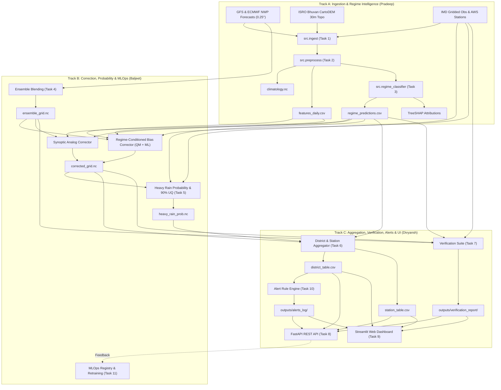

# PS-80 End-to-End System Architecture

This document provides a comprehensive architectural specification of the **Regime-Aware AI Post-Processing of Monsoon Rainfall Forecasts** platform (SIH 2026 Problem Statement PS-80).

---

## 🏛️ High-Level System Architecture

---

## 🧩 Architectural Subsystems

### 1. Track A: Ingestion & Weather Regime Intelligence
* **Ingestion (`src/ingest/`):**
  - Multi-source idempotent loader supporting NOAA GFS, ECMWF open data, IMD daily gridded observations, AWS station networks, and ISRO NRSC Bhuvan CartoDEM 1 arc-second (~30m) digital elevation models.
  - Manifest validation verifying MD5 checksums, coordinate bounds, and temporal ranges.
* **Preprocessing & Feature Engineering (`src/preprocess/`):**
  - Standardizes spatial coordinates onto the regular $0.25^\circ \times 0.25^\circ$ Central India Monsoon Core Zone domain ($18.0^\circ\text{N} - 26.0^\circ\text{N}$, $74.0^\circ\text{E} - 86.0^\circ\text{E}$).
  - Synthesizes 10 daily dynamical and thermodynamical circulation indices (`mslp_anomaly`, `olr_anomaly`, `satellite_proxy`, `rainfall_anomaly`, `lps_flag`, `wd_flag`, `trough_position_lat`, `zonal_shear_850`, `orographic_index`, `coastal_convergence_index`).
* **Multi-label Regime Classification (`src/regime_classifier/`):**
  - Binary Relevance LightGBM gradient-boosted trees trained to recognize 6 synoptic monsoon regimes: **Active**, **Break**, **Low/Depression**, **Western Disturbance**, **Orographic**, and **Coastal**.
  - Computes exact local TreeSHAP attributions per prediction to provide meteorological transparency.

### 2. Track B: Bias Correction, Probability Calibration & MLOps
* **Ensemble Blending (`src/bias_correction/ensemble/`):**
  - Optimal minimum-variance weighted fusion of GFS and ECMWF forecasts to mitigate single-model systematic errors.
* **Regime-Conditioned Error Correction (`src/bias_correction/`):**
  - **Empirical Quantile Mapping (QM):** Regime-specific transfer functions mapped from historical cumulative distribution functions (CDFs).
  - **ML Gradient Boosted Corrector:** Non-linear residual mapping conditioned on synoptic anomalies.
  - **Router:** Automatically selects between QM, ML, or identity based on regime confidence and sample support.
  - **Synoptic Analogs (`src/bias_correction/analog/`):** Searches historical synoptic state space for closest analogue days to project spatial forecast bias patterns.
* **Calibrated Exceedance Probability & UQ (`src/heavy_rain_prob/`):**
  - Calculates exceedance probabilities for IMD Heavy ($\ge 64.5\text{ mm/24h}$) and Very Heavy ($\ge 115.6\text{ mm/24h}$) rainfall events.
  - Regime-stratified conformal residual pools yield distribution-free 90% uncertainty intervals (`[lower, upper]`).
* **MLOps Lifecycle (`src/mlops/`):**
  - Population Stability Index (PSI) drift monitoring on synoptic circulation features.
  - Forecaster feedback collection loop feeding automated model retraining queues.

### 3. Track C: Aggregation, Verification, Alerts, API & UI
* **Areal Aggregation (`src/district_agg/`):**
  - Vectorized ray-casting point-in-polygon algorithm performing area-weighted zonal aggregation over district GeoJSON boundaries.
  - Inverse-distance / nearest-neighbor downscaling for AWS weather station networks.
* **Verification Suite (`src/verification/`):**
  - Continuous metrics: RMSE, MAE, Mean Bias.
  - Categorical skill scores: Probability of Detection (POD), False Alarm Ratio (FAR), Critical Success Index (CSI), Equitable Threat Score (ETS), and Frequency Bias.
  - Multi-scale spatial verification: Fractions Skill Score (FSS) at neighborhood radiuses 1 to 5.
  - Reliability calibration curves comparing predicted probabilities against observed frequencies.
* **Rule-Based Alerting (`src/alerts/`):**
  - Multi-tier alert generation (`CRITICAL`, `ALERT`, `WARNING`) defined in declarative YAML rules (`alert_rules.yaml`).
  - Pluggable delivery interface (`MockLogChannel`, `MockSMSChannel`, `MockEmailChannel`).
* **FastAPI Backend (`api/`):**
  - RESTful endpoints exposing forecasts, uncertainty, verification reports, and CartoDEM integration status with automatic Swagger/OpenAPI documentation.
* **Streamlit Dashboard (`dashboard/`):**
  - Executive-ready interactive web application styled with modern White, Black, and Light Blue aesthetics.
  - Folium map with satellite/terrain/dark basemap switcher, CartoDEM elevation profiler, and active learning forecaster feedback forms.

---

## 🔒 Decoupled Configuration & Data Contracts

All components strictly decouple file paths through [`src/config.py`](../src/config.py):
* `config.yaml`: Production path definitions (`data/raw/`, `data/processed/`, `outputs/`).
* `config.test.yaml`: Isolated fixture paths (`tests/fixtures/`) allowing zero-dependency testing.
* `.env`: External credentials (`CARTODEM_API_KEY`, `BHUVAN_API_KEY`) and active `CONFIG_PATH`.
